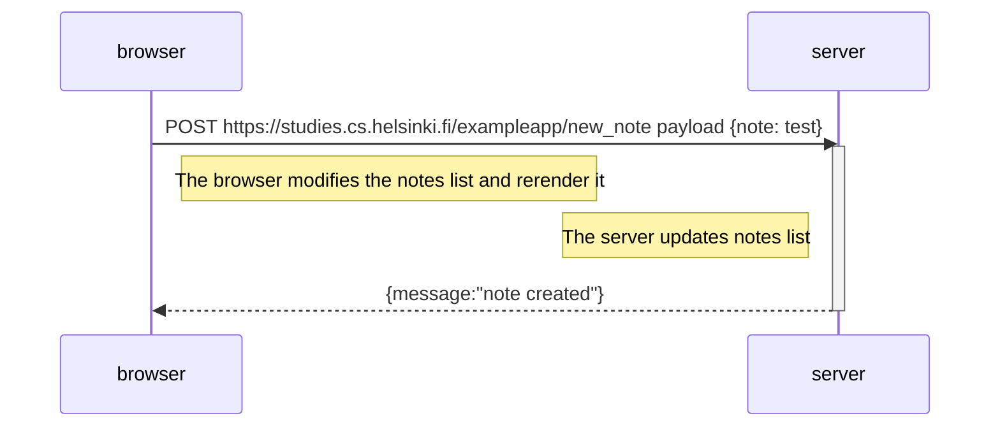

```mermaid
sequenceDiagram
    participant browser
    participant server

    browser->>server: POST https://studies.cs.helsinki.fi/exampleapp/new_note payload {note: test}
    activate server 
    Note right of browser: The browser modifies the notes list and rerender it
    Note left of server: The server updates notes list
    server-->>browser: {message:"note created"}

    deactivate server

```